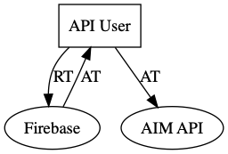

Welcome to the *AIM API - Beta*!

# Beta Stage

The AIM API is in an "beta stage" to gather customer feedback. While in beta, the API may change in backwards incompatible ways to accommodate for fixes and additions. Breaking changes will be communicated to the primary API contact at least 2 business days in advance.

TSG reserves the right to determine what constitutes a breaking changes. A definition of "breaking changes" will be made available before formal release.

<details markdown='1'><summary>AIMVision Metrics Definition</summary>

| Metric Category |AIMVision Metric Name | Metric id  | Metric Definition                          |Applicable Card (or Volume) Type          | Normalizations| 
|:---------------:|----------------------|:-----------|:-------------------------------------------|:-----------------------------------------|:--------------|
|	Activity	|	Volume per Merchant	|	volume	|	Measures average account size of total volumes per active merchant	|	Total, Bankcard, PIN Debit, OptBlue, Other	|	Per Merchant	|
|	Activity	|	Volume per Transaction	|	volume	|	Total volume divided by total transactions	|	Total, Bankcard, PIN Debit, OptBlue, Other, Credit, Signature Debit	|	Per Transaction	|
|	Revenue	|	Total Gross Revenue Charged to Merchant per Volume	|	rev__gross	|	Sum of bankcard, PIN debit and OptBlue gross revenue, total monthly and annual legacy and emerging account fees, total equipment and other income divided by total volume	|	Total	|	Per Volume	|
|	Revenue	|	Total Gross Revenue Charged to Merchant per Merchant	|	rev__gross	|	Sum of bankcard, PIN debit and OptBlue gross revenue, total monthly and annual legacy and emerging account fees, total equipment and other income divided by total active merchants	|	Total	|	Per Merchant	|
|	Revenue	|	Total Gross Revenue Charged to Merchant per Transaction	|	rev__gross	|	Sum of bankcard, PIN debit and OptBlue gross revenue, total monthly and annual legacy and emerging account fees, total equipment and other income divided by total transactions	|	Total	|	Per Transaction	|
|	COS	|	Total Cost of Sales per Volume	|	cost__total	|	Sum of bankcard, PIN debit and OptBlue total cost of sales and total other cost of sales divided by total volume	|	Total	|	Per Volume	|
|	COS	|	Total Cost of Sales per Merchant	|	cost__total	|	Sum of bankcard, PIN debit and OptBlue total cost of sales and total other cost of sales divided by total active merchants	|	Total	|	Per Merchant	|
|	COS	|	Total Cost of Sales per Transaction	|	cost__total	|	Sum of bankcard, PIN debit and OptBlue total cost of sales and total other cost of sales divided by total transactions	|	Total	|	Per Transaction	|
|	Revenue	|	Net Revenue per Volume	|	rev__net	|	Total gross revenue charged to merchant less total cost of sales divided by total volume	|	Total	|	Per Volume	|
|	Revenue	|	Net Revenue per Merchant	|	rev__net	|	Total gross revenue charged to merchant less total cost of sales divided by total active merchants	|	Total	|	Per Merchant	|
|	Revenue	|	Net Revenue per Transaction	|	rev__net	|	Total gross revenue charged to merchant less total cost of sales divided by total transactions	|	Total	|	Per Transaction	|
|	Revenue	|	 Discount Revenue per Volume	|	rev__discount	|	Sum of discount revenue divided by volume for applicable card type	|	Total, Bankcard, PIN Debit, OptBlue, Credit, Signature Debit	|	Per Volume	|
|	Revenue	|	 Transaction Fee Revenue per Volume	|	rev__transaction__fees	|	Sum of transaction fee revenue divided by volume for applicable card type	|	Total, Bankcard, PIN Debit, OptBlue, Credit, Signature Debit	|	Per Volume	|
|	Revenue	|	 Other Processing Fee Revenue per Volume	|	rev__other__fees	|	Sum of other fee revenue divided by volume for applicable card type	|	Total, Bankcard, PIN Debit, OptBlue, Credit, Signature Debit	|	Per Volume	|
|	Revenue	|	 Gross Processing Revenue per Volume	|	rev__gross_processing	|	Sum of discount, transaction fee revenue and other fee revenue divided by volume for applicable card type	|	Total, Bankcard, PIN Debit, OptBlue, Credit, Signature Debit	|	Per Volume	|
|	COS	|	 COS Interchange Fees per Volume	|	cost__interchange__fees	|	Sum of interchange fees divided by volume for applicable card type	|	Total, Bankcard, PIN Debit, OptBlue, Credit, Signature Debit	|	Per Volume	|
|	COS	|	 COS Association Fees & Assessments Fees per Volume	|	cost__association__fees	|	Sum of association fees & assessments divided by volume for applicable card type	|	Bankcard, OptBlue, Credit, Signature Debit	|	Per Volume	|
|	COS	|	COS SWITCH Fees per Volume	|	cost__switch_fees	|	Sum of PIN COS SWITCH fees divided by PIN volume	|	PIN Debit	|	Per Volume	|
|	COS	|	 COS Association Fees & Assessments & SWITCH Fees per Volume	|	cost__association_and_switch_fees	|	Sum of association fees & assessments and SWITCH fees divided by volume for applicable card type	|	Total	|	Per Volume	|
|	COS	|	 COS Other Processing Fees per Volume	|	cost__other__fees	|	Sum of COS other processing fees divided by volume for applicable card type	|	Total, Bankcard, OptBlue, Credit, Signature Debit	|	Per Volume	|
|	COS	|	COS Total Processing Fees per Volume	|	cost__processing	|	Sum of interchange, association and assessment fees, SWITCH fees, and COS other processing fees divided by volume for applicable card type	|	Total, Bankcard, PIN Debit, OptBlue, Credit, Signature Debit	|	Per Volume	|
|	Revenue	|	 Net Processing Revenue per Volume	|	rev__net_processing	|	Gross processing revenue cos total processing fees divided by volume for applicable card type	|	Total, Bankcard, PIN Debit, OptBlue, Credit, Signature Debit	|	Per Volume	|
|	Revenue	|	 Discount Revenue per Merchant	|	rev__discount	|	Sum of discount revenue divided by active merchants for applicable card type	|	Total, Bankcard, PIN Debit	|	Per Merchant	|
|	Revenue	|	 Transaction Fee Revenue per Merchant	|	rev__transaction__fees	|	Sum of transaction fee revenue divided by active merchants for applicable card type	|	Total, Bankcard, PIN Debit	|	Per Merchant	|
|	Revenue	|	 Other Processing Fee Revenue per Merchant	|	rev__other__fees	|	Sum of other fee revenue divided by active merchants for applicable card type	|	Total, Bankcard, PIN Debit	|	Per Merchant	|
|	Revenue	|	 Gross Processing Revenue per Merchant	|	rev__gross_processing	|	Sum of discount, transaction fee revenue and other fee revenue divided by active merchants for applicable card type	|	Total, Bankcard, PIN Debit	|	Per Merchant	|
|	COS	|	 COS Interchange Fees per Merchant	|	cost__interchange__fees	|	Sum of interchange fees divided by active merchants for applicable card type	|	Total, Bankcard, PIN Debit	|	Per Merchant	|
|	COS	|	 COS Association Fees & Assessments Fees per Merchant	|	cost__association__fees	|	Sum of association fees & assessments divided by active merchants for applicable card type	|	Total, Bankcard	|	Per Merchant	|
|	COS	|	COS SWITCH Fees per Merchant	|	cost__switch_fees	|	Sum of PIN COS SWITCH fees divided by PIN active merchants	|	PIN Debit	|	Per Merchant	|
|	COS	|	 COS Association Fees & Assessments & SWITCH Fees per Merchant	|	cost__association_and_switch_fees	|	Sum of association fees & assessments and SWITCH fees divided by active merchants for applicable card type	|	Total	|	Per Merchant	|
|	COS	|	 COS Other Processing Fees per Merchant	|	cost__other__fees	|	Sum of COS other processing fees divided by active merchants for applicable card type	|	Total, Bankcard	|	Per Merchant	|
|	COS	|	COS Total Processing Fees per Merchant	|	cost__processing	|	Sum of interchange, association and assessment fees, SWITCH fees, and COS processing other fees divided by active merchants for applicable card type	|	Total, Bankcard, PIN Debit	|	Per Merchant	|
|	Revenue	|	 Net Processing Revenue per Merchant	|	rev__net_processing	|	Gross processing revenue less cos total processing fees divided by active merchants for applicable card type	|	Total, Bankcard, PIN Debit	|	Per Merchant	|
|	Revenue	|	 Discount Revenue per Transaction	|	rev__discount	|	Sum of discount revenue divided by transactions for applicable card type	|	Total, Bankcard, PIN Debit, OptBlue, Credit, Signature Debit	|	Per Transaction	|
|	Revenue	|	 Transaction Fee Revenue per Transaction	|	rev__transaction__fees	|	Sum of transaction fee revenue divided by transactions for applicable card type	|	Total, Bankcard, PIN Debit, OptBlue, Credit, Signature Debit	|	Per Transaction	|
|	Revenue	|	 Other Processing Fee Revenue per Transaction	|	cost__other__fees	|	Sum of other fee revenue divided by transactions for applicable card type	|	Total, Bankcard, PIN Debit, OptBlue, Credit, Signature Debit	|	Per Transaction	|
|	Revenue	|	 Gross Processing Revenue per Transaction	|	rev__gross_processing	|	Sum of discount, transaction fee revenue and other fee revenue divided by transactions for applicable card type	|	Total, Bankcard, PIN Debit, OptBlue, Credit, Signature Debit	|	Per Transaction	|
|	COS	|	 COS Interchange Fees per Transaction	|	cost__interchange__fees	|	Sum of interchange fees divided by transactions for applicable card type	|	Total, Bankcard, PIN Debit, OptBlue, Credit, Signature Debit	|	Per Transaction	|
|	COS	|	 COS Association Fees & Assessments Fees per Transaction	|	cost__association__fees	|	Sum of association fees & assessments divided by transactions for applicable card type	|	Total, Bankcard, OptBlue, Credit, Signature Debit	|	Per Transaction	|
|	COS	|	COS SWITCH Fees per Transaction	|	cost__switch_fees	|	Sum of PIN COS SWITCH fees divided by PIN transactions	|	PIN Debit	|	Per Transaction	|
|	COS	|	 COS Association Fees & Assessments & SWITCH Fees per Transaction	|	cost__association_and_switch_fees	|	Sum of association fees & assessments and SWITCH fees divided by transactions for applicable card type	|	Total	|	Per Transaction	|
|	COS	|	 COS Other Processing Fees per Transaction	|	cost__other__fees	|	Sum of COS other processing fees divided by transactions for applicable card type	|	Total, Bankcard, OptBlue, Credit, Signature Debit	|	Per Transaction	|
|	COS	|	COS Total Processing Fees per Transaction	|	cost__processing	|	Sum of total interchange, association and assessment fees, SWITCH fees, and COS other processing fees divided by transactions for applicable card type	|	Total, Bankcard, PIN Debit, OptBlue, Credit, Signature Debit	|	Per Transaction	|
|	Revenue	|	 Net Processing Revenue per Transaction	|	rev__net_processing	|	Gross processing revenue less cos total processing fees divided by transactions for applicable card type	|	Total, Bankcard, PIN Debit, OptBlue, Credit, Signature Debit	|	Per Transaction	|
|	Revenue	|	Monthly Legacy Account Fee Revenue per Volume	|	rev__legacy_account_monthly_fees	|	Account related fees charged monthly; including minimums, monthly account fee, statement fee, divided by total volume	|	Total	|	Per Volume	|
|	Revenue	|	Annual Legacy Account Fee Revenue per Volume	|	rev__legacy_account_annual_fees	|	Account related fees charged annually; including minimums, monthly account fee, statement fee, divided by total volume	|	Total	|	Per Volume	|
|	Revenue	|	Monthly Insurance Account Fee Revenue per Volume	|	rev__insurance_monthly_fees	|	Account related Insurance fees charged monthly divided by total volume	|	Total	|	Per Volume	|
|	Revenue	|	Annual  Insurance Account Fee Revenue per Volume	|	rev__insurance_annual_fees	|	Account related Insurance fees charged annually divided by total volume	|	Total	|	Per Volume	|
|	Revenue	|	Monthly PCI Account Fee Revenue per Volume	|	rev__pci_monthly_fees	|	Account related PCI fees charged monthly divided by total volume	|	Total	|	Per Volume	|
|	Revenue	|	Annual PCI Account Fee Revenue per Volume	|	rev__pci_annual_fees	|	Account related PCI fees charged annually divided by total volume	|	Total	|	Per Volume	|
|	Revenue	|	Monthly Govt. Compliance Account Fee Revenue per Volume	|	rev__1099_reporting_monthly_fees	|	Account related Government Compliance fees charged monthly divided by total volume	|	Total	|	Per Volume	|
|	Revenue	|	Annual Govt. Compliance Account Fee Revenue per Volume	|	rev__1099_reporting_annual_fees	|	Account related Government Compliance fees charged annually divided by total volume	|	Total	|	Per Volume	|
|	Revenue	|	Total Monthly Account Fee Revenue per Volume	|	rev__account_fees_monthly	|	Sum of all monthly account fee revenues divided by total volume	|	Total	|	Per Volume	|
|	Revenue	|	Total Annual Account Fee Revenue per Volume	|	rev__account_fees_annual	|	Sum of all annual account fee revenues divided by total volume	|	Total	|	Per Volume	|
|	Revenue	|	Monthly Legacy Account Fee Revenue per Merchant	|	rev__legacy_account_monthly_fees	|	Account related fees charged monthly; including minimums, monthly account fee, statement fee, divided by total active merchants	|	Total	|	Per Merchant	|
|	Revenue	|	Annual Legacy Account Fee Revenue per Merchant	|	rev__legacy_account_annual_fees	|	Account related fees charged annually; including minimums, monthly account fee, statement fee, divided by total active merchants	|	Total	|	Per Merchant	|
|	Revenue	|	Monthly Insurance Account Fee Revenue per Merchant	|	rev__insurance_monthly_fees	|	Account related Insurance fees charged monthly divided by total active merchants	|	Total	|	Per Merchant	|
|	Revenue	|	Annual  Insurance Account Fee Revenue per Merchant	|	rev__insurance_annual_fees	|	Account related Insurance fees charged annually divided by total active merchants	|	Total	|	Per Merchant	|
|	Revenue	|	Monthly PCI Account Fee Revenue per Merchant	|	rev__pci_monthly_fees	|	Account related PCI fees charged monthly divided by total active merchants	|	Total	|	Per Merchant	|
|	Revenue	|	Annual PCI Account Fee Revenue per Merchant	|	rev__pci_annual_fees	|	Account related PCI fees charged annually divided by total active merchants	|	Total	|	Per Merchant	|
|	Revenue	|	Monthly Govt. Compliance Account Fee Revenue per Merchant	|	rev__1099_reporting_monthly_fees	|	Account related Government Compliance fees charged monthly divided by total active merchants	|	Total	|	Per Merchant	|
|	Revenue	|	Annual Govt. Compliance Account Fee Revenue per Merchant	|	rev__1099_reporting_annual_fees	|	Account related Government Compliance fees charged annually divided by total active merchants	|	Total	|	Per Merchant	|
|	Revenue	|	Total Monthly Account Fee Revenue per Merchant	|	rev__account_fees_monthly	|	Sum of all monthly account fee revenues divided by total active merchants	|	Total	|	Per Merchant	|
|	Revenue	|	Total Annual Account Fee Revenue per Merchant	|	rev__account_fees_annual	|	Sum of all annual account fee revenues divided by total active merchants	|	Total	|	Per Merchant	|
|	Revenue	|	Monthly Legacy Account Fee Revenue per Transaction	|	rev__legacy_account_monthly_fees	|	Account related fees charged monthly; including minimums, monthly account fee, statement fee, divided by total transactions	|	Total	|	Per Transaction	|
|	Revenue	|	Annual Legacy Account Fee Revenue per Transaction	|	rev__legacy_account_annual_fees	|	Account related fees charged annually; including minimums, monthly account fee, statement fee, divided by total transactions	|	Total	|	Per Transaction	|
|	Revenue	|	Monthly Insurance Account Fee Revenue per Transaction	|	rev__insurance_monthly_fees	|	Account related Insurance fees charged monthly divided by total transactions	|	Total	|	Per Transaction	|
|	Revenue	|	Annual  Insurance Account Fee Revenue per Transaction	|	rev__insurance_annual_fees	|	Account related Insurance fees charged annually divided by total transactions	|	Total	|	Per Transaction	|
|	Revenue	|	Monthly PCI Account Fee Revenue per Transaction	|	rev__pci_monthly_fees	|	Account related PCI fees charged monthly divided by total transactions	|	Total	|	Per Transaction	|
|	Revenue	|	Annual PCI Account Fee Revenue per Transaction	|	rev__pci_annual_fees	|	Account related PCI fees charged annually divided by total transactions	|	Total	|	Per Transaction	|
|	Revenue	|	Monthly Govt. Compliance Account Fee Revenue per Transaction	|	rev__1099_reporting_monthly_fees	|	Account related Government Compliance fees charged monthly divided by total transactions	|	Total	|	Per Transaction	|
|	Revenue	|	Annual Govt. Compliance Account Fee Revenue per Transaction	|	rev__1099_reporting_annual_fees	|	Account related Government Compliance fees charged annually divided by total transactions	|	Total	|	Per Transaction	|
|	Revenue	|	Total Monthly Account Fee Revenue per Transaction	|	rev__account_fees_monthly	|	Sum of all monthly account fee revenues divided by total transactions	|	Total	|	Per Transaction	|
|	Revenue	|	Total Annual Account Fee Revenue per Transaction	|	rev__account_fees_annual	|	Sum of all annual account fee revenues divided by total transactions	|	Total	|	Per Transaction	|
|	Revenue	|	Equipment & Other (Non-Processing) Revenue per Volume	|	rev__equipment_and_other	|	Sum of equipment rental, lease and sale and other revenues divided by total volume	|	Total	|	Per Volume	|
|	Revenue	|	Equipment & Other (Non-Processing) Revenue per Merchant	|	rev__equipment_and_other	|	Sum of equipment rental, lease and sale and other revenues divided by total active merchants	|	Total	|	Per Merchant	|
|	Revenue	|	Equipment & Other (Non-Processing) Revenue per Transaction	|	rev__equipment_and_other	|	Sum of equipment rental, lease and sale and other revenues divided by total transactions	|	Total	|	Per Transaction	|
|	COS	|	Total Other (Non-Processing) COS per Volume	|	cost__other	|	Sum of other cost of sales including gateway fees, processor fees and sponsor bank fees divided by total volume	|	Total	|	Per Volume	|
|	COS	|	Total Other (Non-Processing) COS per Merchant	|	cost__other	|	Sum of other cost of sales including gateway fees, processor fees and sponsor bank fees divided by total active merchants	|	Total	|	Per Merchant	|
|	COS	|	Total Other (Non-Processing) COS per Transaction	|	cost__other	|	Sum of other cost of sales including gateway fees, processor fees and sponsor bank fees divided by total transactions	|	Total	|	Per Transaction	|
|	COS	|	Residuals Paid per Volume	|	cost__residuals	|	Sum of residuals to 1099 agents, agent banks, integrated referral partners, association referral partners and other referral partners divided by total volume	|	Total	|	Per Volume	|
|	COS	|	Residuals Paid per Merchant	|	cost__residuals	|	Sum of residuals to 1099 agents, agent banks, integrated referral partners, association referral partners and other referral partners divided by total active merchants	|	Total	|	Per Merchant	|
|	COS	|	Residuals Paid per Transaction	|	cost__residuals	|	Sum of residuals to 1099 agents, agent banks, integrated referral partners, association referral partners and other referral partners divided by total transactions	|	Total	|	Per Transaction	|
|	Revenue	|	Net Revenue Net of Residuals per Volume	|	rev__gross_profit	|	Total net revenue less total residuals divided by total volume	|	Total	|	Per Volume	|
|	Revenue	|	Net Revenue Net of Residuals per Merchant	|	rev__gross_profit	|	Total net revenue less total residuals divided by total active merchants	|	Total	|	Per Merchant	|
|	Revenue	|	Net Revenue Net of Residuals per Transaction	|	rev__gross_profit	|	Total net revenue less total residuals divided by total transactions	|	Total	|	Per Transaction	|
|	Attrition	|	Account Attrition	|	attrited_merchant_count	|	Total attrited accounts in given period divided by total portfolio active accounts from same period of the prior year	|	Total	|	Merchant Count of Prior Year	|
|	Growth	|	New Accounts Added	|	new_merchant_count	|	Total new accounts in given period divided by total portfolio accounts from same period of the prior year	|	Total	|	Merchant Count of Prior Year	|
|	Attrition	|	Volume Gross Attrition	|	gross_volume_attrited	|	Total volume of attrited accounts from given period of prior year divided by total portfolio volume from same period of the prior year	|	Total	|	Total Volume of Prior Year	|
|	Attrition	|	Change in Retained Account Volume	|	change_in_retained_volume	|	Annual volume change/growth of retained (non-attrited) accounts for given period divided by total portfolio volume from same period of the prior year	|	Total	|	Total Volume of Prior Year	|
|	Attrition	|	Volume Net Attrition	|	volume_net_attrition	|	Sum of volume gross attrition and change in retained account volume divided by total portfolio volume from same period of the prior year	|	Total	|	Total Volume of Prior Year	|
|	Growth	|	Volume Added from New Accounts	|	new_gross_volume	|	Volume added in current period from new accounts divided by total portfolio volume of same period of the prior year 	|	Total	|	Total Volume of Prior Year	|
|	Attrition	|	Net Revenue Gross Attrition	|	gross_net_revenue_attrited	|	Total net revenue of attrited accounts from given period of prior year divided by total portfolio net revenue from same period of the prior year	|	Total	|	Total Net Revenue of Prior Year	|
|	Attrition	|	Change in Retained Account Net Revenue	|	change_in_retained_net_revenue	|	Annual net revenue change/growth of retained (non-attrited) accounts for given period divided by total portfolio net revenue from same period of the prior year	|	Total	|	Total Net Revenue of Prior Year	|
|	Attrition	|	Net Revenue Net Attrition	|	net_revenue_net_attrition	|	Sum of net revenue gross attrition and change in retained account net revenue divided by total portfolio net revenue from same period of the prior year	|	Total	|	Total Net Revenue of Prior Year	|
|	Growth	|	Net Revenue Added from New Accounts	|	new_net_revenue	|	Net revenue added in current period from new accounts divided by total portfolio net revenue of same period of the prior year 	|	Total	|	Total Net Revenue of Prior Year	|
|	Attrition	|	Average Attrited Account Size	|	avg_attrited_account_size	|	Sum of volume gross attrition divided by sum of attrited merchants for given time period; measures size of attriting accounts	|	Total	|	Per Attrited Merchant	|
|	Attrition	|	Average Retained Account Size	|	 avg_retained_account_size	|	Total portfolio volume less attrited volume (volume gross attrition) divided by total portfolio accounts less attrited accounts (account attrition); measures size of retained (non-attrited) accounts	|	Total	|	Per Retained Merchant	|
|	Growth	|	Average New Account Size	|	avg_new_account_size	|	Total volume added from new accounts divided by total new accounts; measures size of new accounts	|	Total	|	Per New Merchant	|
|	Attrition	|	Net Revenue BPS on Attrited Accounts	|	avg_net_rev_bps_attrited	|	Gross net revenue attrited divided by gross volume attrited; measures net revenue/pricing on attrited accounts	|	Total	|	Per Attrited Volume	|
|	Attrition	|	Net Revenue BPS on Retained Accounts (Pre-Change)	|	avg_net_rev_bps_retained_pre	|	Total portfolio net revenue less attrited net revenue divided by total portfolio volume less attrited volume; measures net revenue spread/pricing on retained (non-attrited) accounts prior to their year over year change/growth	|	Total	|	Per Retained Volume Pre-YOY Change	|
|	Attrition	|	Net Revenue BPS on Retained Accounts (Post-Change)	|	avg_net_rev_bps_retained_post	|	Total retained account net revenue divided by total retained account volumes after the year over year change; measures the net revenue/spread on retained (non-attrited) accounts after the year over year change/growth	|	Total	|	Per Retained Volume Post-YOY Change	|
|	Growth	|	Net Revenue BPS on New Accounts	|	avg_net_rev_bps_new	|	Total net revenue added from new accounts divided by total volume added from new accounts; measures net revenue/pricing on new accounts	|	Total	|	Per New Volume	|


</details>

# HTTP API

## API Discovery

In order to reduce client coupling, the AIM API provides an API discovery document available at:

<a class="discovery-config-url"></a>

<pre><code id="discovery-config"></code></pre>

The primary attributes of interest is the `urls` object, which provides static names to full or partial URLs.

## Authentication

The AIM API leverages [Firebase Authentication](https://firebase.google.com/docs/auth) to securely authenticate services and users. To enable API usage, service accounts are created and used to generate a secret Refresh Token that is given to the primary API contact.

These Refresh Tokens do not expire and can be used to retrieve short lived ID Tokens. ID Tokens are used to directly communicate with the AIM API, which will validate the ID Token.

In short, the authentication flow looks like the following:
1. Exchange a Refresh Token for an ID Token with Firebase
2. Use the ID Token with the AIM API
3. Repeat step 1 as the previous ID Token expires



Once acquired, the ID Token must be sent in the `Authorization` HTTP Header as a `Bearer` token.

As ID Tokens are short lived, a new one must be fetched before expiration and replaced in requests to the API. ID Tokens are [JSON Web Tokens](https://jwt.io/), so any standard JWT libary can be used to decode them and inspect the `exp` entry for a Unix timestamp after which the token will be rejected by the API. A number of JWT libraries are referenced in the link above.

### Obtain an ID Token

In order to obtain an ID Token, use the `id_token` url from the [Discovery document](#api-discovery), which allows us to exchange our Refresh Token for a fresh ID Token.

<a class="id_token-url"></a>

Make a POST request with the following payload, injecting the Refresh Token as specified: `{"grant_type": "refresh_token", "refresh_token": <API Key>}`. Extract the `id_token` field from the response, which contains the ID Token, which can then be sent to the API.

For example, with `curl` to make the request and `jq` to extract the field:

```sh
ID_TOKEN_URL="<ID Token Discovery URL>"
API_KEY="<Refresh Token>"
curl -fsSl -XPOST \
     -H "Content-Type: application/json" \
     -d "{\"grant_type\": \"refresh_token\", \"refresh_token\": \"$API_KEY\"}" \
     "$ID_TOKEN_URL" \
     | jq -r '.id_token'
```

You now have an ID Token that can be used with the AIM API!

### Abuse and Privacy

In order to prevent abuse and data leaks, Refresh Tokens must be stored securely. In particular, avoid unneeded sharing of Refresh Tokens or storing them in source files/source control.

If you suspect your Refresh Token has been compromised, contact <mailto:AIM@thestrawgroup.com> as soon as possible. If abuse is suspected, TSG may disable Refresh Tokens immediately and follow up with the API contact.

## Query API

The Query API is the primary tool provided by the AIM API. It provides powerful data analysis across multiple dimensions of the AIM dataset.

The Query API is comprised of four (4) primary components:
- `aggregation`
- `attribute`
- `metric`
- `normalization`

Each component has a discovery endpoint to obtain the available items with full metadata. All query urls are based from the `warehouse` url in the [discovery document](#api-discovery):

<code class="warehouse-url"></code>


### Important

1) The portfolio is a required parameter to be pass with every API request.
2) You can toggle between the market benchmark and the fluid benchmark by setting portfolio=-1 for the market benchmark and portfolio=-2 for the fluid benchmark.


### Quickstart

After [acquiring an ID Token](#obtain-an-id-token), start with a few simple API calls. The calls will use `curl` for demonstration, but of course, any HTTP client will do. In these examples, `BASE_URL` is set to <code class="warehouse-url"></code>. Any query results are for demonstration purposes only and do not represent real values.

```
# Inspect all attributes. Note the rich metadata describing the data type, filter config and values, among other things. These attributes determine how the data can be filtered and grouped.
curl -H "Authorization: Bearer $ID_TOKEN" \
        "$BASE_URL/attribute/"

# Inspect all metrics. Notice that metrics have "availability" metadata describing what attributes and normalizations they support.
curl -H "Authorization: Bearer $ID_TOKEN" \
        "$BASE_URL/metric/"

# Let's run a query to pull out volume data:

# Example with market benchmark
curl -H "Authorization: Bearer $ID_TOKEN" \
        "$BASE_URL/query?metrics=volume&filter=date=2020-01;portfolio=-1"
# [
#   {
#     "volume":12864.75939
#   }
# ]

# Example with fluid benchmark
curl -H "Authorization: Bearer $ID_TOKEN" \
        "$BASE_URL/query?metrics=volume&filter=date=2020-01;portfolio=-2"
 
# [
#   {
#    "volume": 12903.352
#   }
# ]

# By default, calculations are "Per Merchant", but another normalization can be selected. Let's try some different metrics with "Per Transaction"

# Example with market benchmark
curl -H "Authorization: Bearer $ID_TOKEN" \
        "$BASE_URL/query?metrics=volume&filter=date=2020-01;portfolio=-1&normalizations=transaction"
# [
#   {
#     "volume": 73.43840
#   }
# ]

# Example with fluid benchmark
curl -H "Authorization: Bearer $ID_TOKEN" \
        "$BASE_URL/query?metrics=volume&filter=date=2020-01;portfolio=-2&normalizations=transaction"
 
# [
#   {
#     "volume": 103.352
#   }
# ]


# You can also pass your portfolio id with the market benchmark and the fluid benchmark value and group by portfolio to see the desired result.
 
# Note: Benchmark(s) cannot be selected with other portfolios without 'Group by Portfolio'

# Example with Market Benchmark
curl -H "Authorization: Bearer $ID_TOKEN" \
        "$BASE_URL/query?metrics=volume&filter=date=2020-01;portfolio=-1,{your portfolio id}&group_by=portfolio&normalizations=transaction"
 
# [
#   {
#     "portfolio": {your portfolio id},
#     "volume": 79.195
#   },
#   {
#     "portfolio": -1,
#     "volume": 102.963
#   }
# ]
 
# Example with Fluid Benchmark
 
curl -H "Authorization: Bearer $ID_TOKEN" \
        "$BASE_URL/query?metrics=volume&filter=date=2020-01;portfolio=-2,{your portfolio id}&group_by=portfolio&normalizations=transaction"                                                                                                                                                                                                                                                                                                           
# [
#   {
#     "portfolio": {your portfolio id},
#     "volume": 79.195
#   },
#   {
#     "portfolio": -2,
#     "volume": 103.352
#   }
# ]
 

# Example with Market and Fluid Benchmark
 
curl -H "Authorization: Bearer $ID_TOKEN" \
        "$BASE_URL/query?metrics=volume&filter=date=2020-01;portfolio=-2,-1,{your portfolio id}&group_by=portfolio&normalizations=transaction"
 
# [
#   {
#     "portfolio": -2,
#     "volume": 103.352
#   },
#   {
#     "portfolio": {your portfolio id},
#     "volume": 79.195
#   },
#   {
#     "portfolio": -1,
#     "volume": 102.963
#   }
# ]

# In addition to filtering by a specific month, a range can be provided. Once a date range has been specified, it can be "grouped" so the result set contains the average for each month, instead of the average across the months:

curl -H "Authorization: Bearer $ID_TOKEN" \
        "$BASE_URL/query?metrics=volume&filter=date=2020-01,2020-03;portfolio=-1&group_by=date"
# [
#   {
#     "date": "2020-01-01",
#     "volume": 28352.73849
#   },
#   {
#     "date": "2020-02-01",
#     "volume": 27424.03418
#   },
#   {
#     "date": "2020-03-01",
#     "volume": 38738.38481
#   }
# ]

# Now, let's see the volume for credit and sig debit:

curl -H "Authorization: Bearer $ID_TOKEN" \
        "$BASE_URL/query?metrics=volume&filter=date=2020-01;portfolio=-1;card=credit,sig_debit&group_by=card"
# [
#  {
#    "card": "credit",
#    "volume": 28327.3061
#  },
#  {
#    "card": "sig_debit",
#    "volume": 1924.48568
#  }
#]

# How about focused on Omaha, Iowa, Kansas, and Missouri?

curl -H "Authorization: Bearer $ID_TOKEN" \
        "$BASE_URL/query?metrics=volume&filter=date=2020-01;portfolio=-1;card=credit,sig_debit;state=MO,KS,NE,IA&group_by=card"
# [
#   {
#     "card": "credit",
#     "volume": 23394.83581
#   },
#   {
#     "card": "sig_debit",
#     "volume": 1483.83589
#   }
# ]

# Putting these examples together, one can see metrics per transaction in specific states grouped by card and date.

curl -H "Authorization: Bearer $ID_TOKEN" \
        "$BASE_URL/query?metrics=volume&filter=date=2020-01,2020-03;portfolio=-1;card=credit,sig_debit;state=MO,KS,NE,IA&group_by=date,card&normalizations=transaction"
# [
#   {
#     "card": "credit",
#     "date": "2020-01-01",
#     "volume": 53.77786
#   },
#   {
#     "card": "sig_debit",
#     "date": "2020-01-01",
#     "volume": 8.38631
#   },
#   {
#     "card": "credit",
#     "date": "2020-02-01",
#     "volume": 68.85441
#   },
#   {
#     "card": "sig_debit",
#     "date": "2020-02-01",
#     "volume": 2.41721
#   },
#   {
#     "card": "credit",
#     "date": "2020-03-01",
#     "volume": 58.09631
#   },
#   {
#     "card": "sig_debit",
#     "date": "2020-03-01",
#     "volume": 5.42187
#   }
# ]
```

### Aggregation

Abstract aggregation operation.
    

<details markdown='1'><summary>Aggregations</summary>

#### None


#### 3 Month Moving Average

Periods = 3, Frequency = Month
    

#### 6 Month Moving Average

Periods = 6, Frequency = Month
    

#### 12 Month Moving Average

Periods = 12, Frequency = Month
    

#### 18 Month Moving Average

Periods = 18, Frequency = Month
    

</details>

### Attributes

Attributes provide the ability to filter and slice data.

    

<details markdown='1'><summary>Attributes</summary>

#### Card

**Card** is an attribute of central importance in the AIM system.

There are 5 basic card types:
- credit
- signature_debit aka *sig_debit*
- pin_debit
- opt_blue

And 2 non-basic card types:
- bank_cards (credit + sig_debit)
- other_cards

The metrics coming from raw processor data which are reported on individual
card types may be filtered and grouped by card types and are referred to as
"card metrics" as opposed to "non-card metrics".

#### Average Ticket Tier

A merchant's ticket tier is based on its **average** number of transactions (or "tickets")
over a rolling 12 month period.

#### Annual Volume Tier

A merchant's volume tier is based on its **total** volume over a rolling 12 month period.
    

#### Region

Geographic region of the transaction.
    

#### State

U.S. State of the transaction

#### ZIP

Zip code of the transaction

#### MSA

City of the transaction

#### Sales Model

Sales model code

#### Industry Classification Type

Industry Classification Type. Currently this is either MCC or SIC.
    

#### Industry Group

Hierarchical grouping of Industries
    

#### Industry

Industry the merchant belongs to.
    

#### Portfolio

A grouping of merchants within an organization.
    

#### Data Month

Date is one of the AIM required attributes.
Traditionally date has been by month due to month being the frequency of the aim
application, though other aggregation levels are possible and may show up in the
future. The term era is used to denote a chunk of time. Ex. The month of June, as
opposed to June 1.

#### Standalone Merchants

Binary on if the merchant is part of a chain or not.

#### Vintage

Year merchant entered the market

</details>

### Metrics

Base metric class.
    

<details markdown='1'><summary>Metrics</summary>

#### COS Total Processing Fees

Processing Cost
Contains card components only

#### Total Cost of Sales

Total Cost
:= Total Cost Card + Total Cost Noncard

#### Gross Revenue

Gross Revenue
:= Gross Revenue Card + Gross Revenue Noncard
Contains card and noncard components

#### Gross Processing Revenue

Gross Processing Revenue
Contains card components only

#### Net Revenue

Net Revenue
:= Net Revenue Card + Net Revenue Noncard
Contains card and noncard components

#### Net Processing Revenue

Net Processing Revenue
Contains card components only

#### COS Association Fees, Assessments, and SWITCH Fees

Association And Switch Fees Cost
No card components

#### COS Association Fees & Assessments

Association Fees Cost

#### COS SWITCH Fees

Switch Fees Cost

#### COS Interchange Fees

Interchange Fees Cost
No card components

#### COS Other Processing Fees

Other Fees Cost
No card components

#### Other COS

Other Cost
No card components

#### Residuals Paid

Residuals Cost
No card components

#### Legacy Account Annual Fees Revenue

Legacy Account Annual Fees Revenue
No card components

#### Monthly Legacy Account Fees

Legacy Account Monthly Fees Revenue
No card components

#### Discount Revenue

Discount  Revenue
Contains card components only

#### Equipment & Other Income

Equipment and Other Revenue
Contains card components only

#### Gross Profit

Gross Profit Revenue
Contains card components only

#### Legacy Account Annual and Monthly Fees Revenue

Legacy Account Annual and Monthly Fees Revenue
Contains card components only

#### Other Fee Revenue

Other Fees Revenue
No card components

#### PCI Annual And Monthly Fees Revenue

PCI Annual And Monthly Fees Revenue
No card components

#### Transaction Fee Revenue

Transaction Fees Revenue
No card components

#### Transactions

Transaction
Contains card components only

#### Volume

Volume
Contains card components only

#### Account Attrition


#### New Accounts Added


#### Gross Volume Attrition


#### Change in Retained Account Volume


#### Volume Net Attrition


#### New Volume Added


#### Net Revenue Gross Attrition


#### Change in Retained Account Net Revenue


#### Net Revenue Net Attrition


#### New Net Revenue Added


#### Average Attrited Account Size


#### Average Retained Account Size


#### Average New Account Size


#### Average Net Revenue BPS on Attrited Accounts


#### Average Net Revenue BPS on Retained Accounts (Pre Change)


#### Average Net Revenue BPS on Retained Accounts (Post Change)


#### Average Net Revenue BPS on New Accounts

</details>

### Normalization

Abstract Metric Normalizer.

AIM normalizations are of the form: **sum(metric)/sum(normalizing_metric)** .

There are three columns used in AIM normalization (with corresponding units):

- Volume ($)
- Transactions (-)
- Active Merchants (-)

Where "-" is a null unit.

Unit Matrix::

```
===================  ======  ============  ================
Metric / Normalizer  Volume  Transactions  Active Merchants
===================  ======  ============  ================
Transactions           -          -               -
Volume                 -          $               $
All Other Metrics      -          $               $
===================  ======  ============  ================
```

<details markdown='1'><summary>Normalizations</summary>

#### Per Merchant

Active Merchants
In order to be considered active a merchant has to have non-zero Volume and
Net Revenue > 0.
Unitless due to being a count.

#### Per Merchant - Attrited


#### Per Merchant - Retained


#### Per Merchant - Last Year


#### Per Merchant - New


#### Per Transaction

Transactions - Unitless due to being a count.
    

#### Per Volume

Volume - Units in dollars.

#### Per Volume - Attrited


#### Per Change in Volume - Retained 


#### Per Volume - Last Year


#### Per Volume - New


#### Per Net Revenue - Attrited


#### Per Change in Net Revenue - Retained


#### Per Net Revenue - Last Year


#### Per Net Revenue - New


#### Per Merchant - Retained Account Size


#### Per Merchant - Retained Account Size Pre-Change


#### Per Merchant - Retained Account Size Post-Change

</details>


<footer><p style='text-align:center'>© The Strawhecker Group. All Rights Reserved.</p></footer>

<script src="./README.js"></script>
